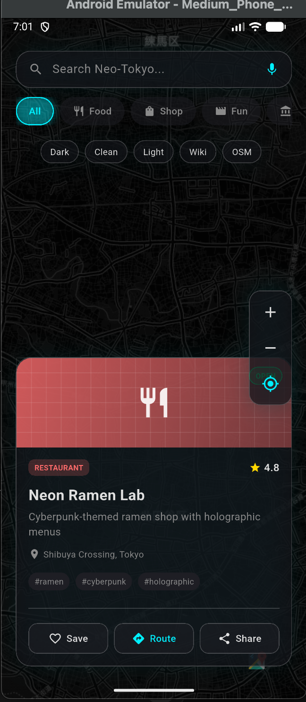
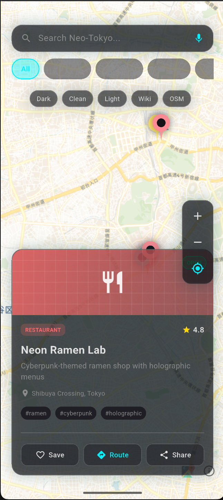
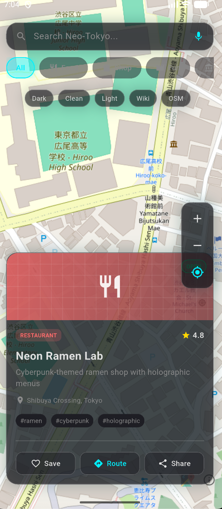

# 🌃 Neo-Tokyo Map | Flutter Cyberpunk Map App

A futuristic cyberpunk-themed map application built with Flutter using **100% FREE real maps** - no API keys required!


[](LICENSE)

## 🎥 YouTube Demo
[Watch Video](YOUR_YOUTUBE_LINK_HERE)

## 📸 Screenshots

| Dark Mode | Clean | OSM |
|-----------|------------|------------------|
|  |  |  |

## ✨ Features

- 🗺️ **Real Maps** - OpenStreetMap & CARTO (completely free, no API keys)
- 🎨 **Cyberpunk UI** - Glassmorphism design with neon accents
- 📍 **Custom Markers** - Animated location pins by category
- 🧭 **Free Routing** - OSRM directions & navigation
- 🎭 **Multiple Themes** - Dark, Light, Voyager, Cycle modes
- ⚡ **High Performance** - Optimized with object pooling & debouncing

## 🚀 Getting Started

### Prerequisites
- Flutter SDK 3.0+
- Dart 3.0+

### Installation

```bash
# Clone repository
git clone https://github.com/Aamirsiddique09/flutter-cyberpunk-map.git

# Navigate to project
cd flutter-cyberpunk-map

# Install dependencies
flutter pub get

# Run the app
flutter run
